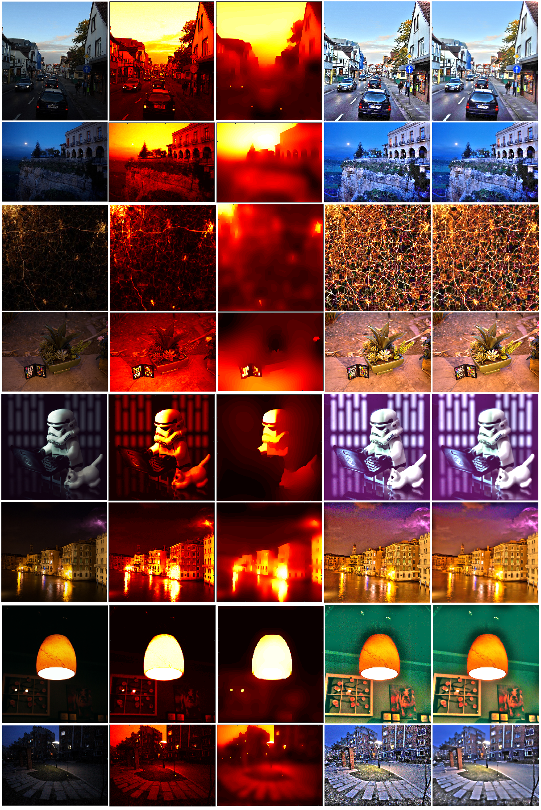
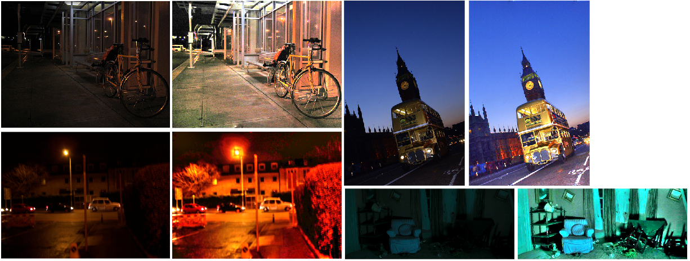

# LIME: Low-light Image Enhancement

This is a MATLAB implementation of the paper, "LIME: Low-Light Image Enhancement via Illumination Map Estimation". It was done as a course project for Digital Image Processing (ECN-316), under the guidance of Prof. Saumik Bhattacharya.

* The project report can be found [here](https://drive.google.com/file/d/1aph-GUsr_Br2dMLTR3e0kYqAM5aThmj1/view).
* The paper can be found [here](https://ieeexplore.ieee.org/document/7782813).
* The official website for the project can be found [here](https://sites.google.com/view/xjguo/lime). The demo software provided by the authors contains `.p` mat files, for which source code can't be read.

## How to Use 
### Clone the repository:
```
git clone https://github.com/estija/LIME.git
```

&nbsp; Open MATLAB, go to the git repository folder.

### Add paths
&nbsp; Run the following to the MATLAB command window:
```
addpath('./BM3D');
addpath('./imgs');
```
### Load images and run

&nbsp; Run the following commands in the MATLAB command window:
```
img_in = imread('x.bmp'); 
[Ti, Tout, img_out, Iout] = lime_main_module(img_in, mu, rho, ds, ss, flag); 
```

* `x` is some image from `imgs`
* `flag = 1` to view the results. 
* `Ti` and `Tout` are initial and refined illumination maps, `img_out` and `Iout` are enhanced and denoised results.
* Use the table mentioned below for selecting optimum values of `mu`, `rho`, `ds`, `ss` for each image.

### Table for optimized hyperparameters

|	Name	| `mu`	| `rho`	| `ds`	| `ss` | 
| --- | --- | --- | --- | --- |
|	building | 0.01	| 1.188	| 10	| 1.5 |
|	cars	 | 0.045	| 1.134	| 5	| 0.75 |
|	lamp	 | 0.8	| 1.07	| 0.1	| 1 |
|	land	 | 0.5	| 1.09 |	0.3 |	4 |
|	moon	 | 0.01	| 1.2	| 1	| 0.5 |
|	paint	 | 0.3	| 1.15	| 1 	| 0.5|
|	robot	 | 0.01	| 1.25	| 10	| 1 |
|	table	 | 0.002	| 1.035	| 100	| 1 |
|	wires	 | 0.01	| 1.165	| 1	| 0.6 |


### Information regarding other files: 

* `lime_loop.m` is the file for tuning the parameters for the solver, i. e. alpha, mu, rho.

* `lime_bf_loop.m` is the file for tuning the parameters for the bilateral filter, i. e. ds, ss. By default, `lime_bf_loop.m` is used for post-processing.

* `histeq_all.m` is the file for generating the results of applying histogram equalization, on the raw image, in five different ways.

* `denoise_bm3d.m` is the file for denoising the enhanced result using BM3D.

* The code for BM3D in file `BM3D.m` as well as other files related to it have been downloaded and used only for the purpose of comparison with bilateral filtering.

## Results


> **First column**: Low-light images, **second column**: heat map of initial illumination map, **third column**: heat map of estimated illumination map, **fourth column**: enhanced results, fifth column: denoised results via bilateral filtering. 

<p align = "left"></p>

> Some low-light images from **ExDark dataset**, and results obtained from our implementation.

## Citation
If you find this code helpful and use it in your research, please cite the following work:
```
@ARTICLE{guo_lime,
  author={X. {Guo} and Y. {Li} and H. {Ling}},
  journal={IEEE Transactions on Image Processing}, 
  title={LIME: Low-Light Image Enhancement via Illumination Map Estimation}, 
  year={2017},
  volume={26},
  number={2},
  pages={982-993},}
```
